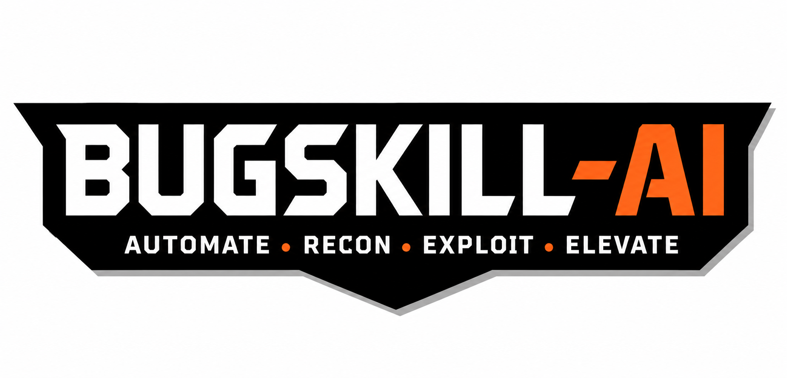

<p align="center">
  
</p>

<h1 align="center">🛡️ BugSkill AI: HackerOne Bug Bounty Intelligence & Awesome AI Agent Skills</h1>

<p align="center">
  <a href="https://www.python.org/"></a>
  <a href="https://opensource.org/licenses/MIT"></a>
  <a href="https://api.hackerone.com/"></a>
  <a href="#-dataset-overview"></a>
  <a href="#-dataset-overview"></a>
  <a href="#-curated-agent-skills-collections"></a>
  <a href="#-zero-external-dependencies"></a>
</p>

An enterprise-grade repository combining **9,950+ real-world disclosed HackerOne bug bounty reports** ($3.26M+ in bounties paid) with two curated, modular, dynamic collections of **Universal AI Agent Skills** (`Awesome-Claude-Code-Agent-Skills/` & `Personal-Claude-Code-Agent-Skills/`) built for next-generation AI coding assistants: **Claude Code**, **Gemini CLI**, **Google Antigravity**, **ChatGPT / Codex CLI**, and **Cursor**.

---

## 📑 Table of Contents

- [📊 Dataset Overview](#-dataset-overview)
- [📦 Curated Agent Skills Collections](#-curated-agent-skills-collections)
  - [1. Awesome Claude Code Skills (`Awesome-Claude-Code-Agent-Skills/`)](#1-awesome-claude-code-skills-awesome-claude-code-agent-skills)
  - [2. Personal Bug Bounty Intelligence Skills (`Personal-Claude-Code-Agent-Skills/`)](#2-personal-bug-bounty-intelligence-skills-personal-claude-code-agent-skills)
- [📁 Clean Repository Layout](#-clean-repository-layout)
- [⚡ Zero External Dependencies](#-zero-external-dependencies)
- [🤖 Universal Agent Skills Framework ("Using It")](#-universal-agent-skills-framework-using-it)
  - [1. Cross-Agent Compatibility Matrix](#1-cross-agent-compatibility-matrix)
  - [2. One-Command Universal Sync](#2-one-command-universal-sync)
  - [3. Using with Claude Code](#3-using-with-claude-code)
  - [4. Using with Gemini CLI & Google Antigravity](#4-using-with-gemini-cli--google-antigravity)
  - [5. Using with ChatGPT / Codex CLI](#5-using-with-chatgpt--codex-cli)
  - [6. Using with Cursor / VS Code](#6-using-with-cursor--vs-code)
- [🔎 Offline Report Search & Intelligence CLI (`search_reports.py`)](#-offline-report-search--intelligence-cli-search_reportspy)
- [⚡ HackerOne Hacktivity Downloader (`hackerone_public.py`)](#-hackerone-hacktivity-downloader-hackerone_publicpy)
- [📜 License & Responsible Disclosure](#-license--responsible-disclosure)

---

## 📊 Dataset Overview

The repository includes an offline intelligence dataset of **`9,950` disclosed vulnerability reports** fetched directly from the official HackerOne Hacktivity REST API.

| Metric | Details |
| :--- | :--- |
| **Total Disclosed Reports** | **9,950** vulnerabilities |
| **Total Bounty Value Paid** | **$3,264,576.00+** |
| **Bounty Rewarded Reports** | **1,832** reports (Average: **$1,781.97** per rewarded bug) |
| **Top Rewarded Vulnerability** | **$50,000.00** (Shopify GitHub access token exposure) |
| **Dataset File** | [`hackerone_public_reports.json`](hackerone_public_reports.json) (13.7 MB JSON) |
| **Key Vulnerability Classes** | IDOR, SSRF, OTP/2FA Bypass, Rate Limiting, RCE, OAuth Flaws, ATO, Race Conditions |

---

## 📦 Curated Agent Skills Collections

### 1. Awesome Claude Code Skills (`Awesome-Claude-Code-Agent-Skills/`)

A curated collection of **13 open-source offensive security, reconnaissance, and bug bounty skills**:

| Skill Directory | Focus Area | Description | Primary Invocations & Tools |
| :--- | :--- | :--- | :--- |
| [`403Bypass`](Awesome-Claude-Code-Agent-Skills/403Bypass/) | Access Control / WAF | Automated 403 Forbidden bypass testing using Jason Haddix's methodology | `/403Bypass`, `bypass403.sh`, `bypass403-batch.sh` |
| [`ApexDiscovery`](Awesome-Claude-Code-Agent-Skills/ApexDiscovery/) | Reconnaissance | Root and apex domain discovery across acquisitions, subsidiaries & reverse WHOIS | `/ApexDiscovery`, `apex-discover.sh`, `tenn.sh` |
| [`AsnRecon`](Awesome-Claude-Code-Agent-Skills/AsnRecon/) | Network Footprinting | ASN and owned IPv4 range reconnaissance using `bgp.he.net` | `/AsnRecon`, `FindAsn.md`, `FindIpRanges.md` |
| [`bac-analyzer`](Awesome-Claude-Code-Agent-Skills/bac-analyzer/) | Broken Access Control | Passive HTTP traffic analysis (HAR, Caido, Burp XML) for IDOR & BAC flaws | `analyze traffic`, `check for IDOR`, Python analyzers |
| [`BugBountyWorkflow`](Awesome-Claude-Code-Agent-Skills/BugBountyWorkflow/) | Workflow & Reporting | End-to-end bug bounty hunting workflows, report drafting, and CVSS scoring | `/BugBountyWorkflow`, HackerOne & Bugcrowd templates |
| [`CacheDeception`](Awesome-Claude-Code-Agent-Skills/CacheDeception/) | Web Cache Attacks | Web cache deception and cache poisoning exploitation | `/CacheDeception`, path confusion, delimiter vectors |
| [`crawl`](Awesome-Claude-Code-Agent-Skills/crawl/) | Web Crawling & Mapping | Unified Python wrapper for deep web crawling with `hakrawler` and `gospider` | `/crawl`, `scripts/crawl.py` |
| [`jsa`](Awesome-Claude-Code-Agent-Skills/jsa/) | JavaScript Security | Automated JavaScript analysis for endpoints, secrets & XSS sinks via Chrome DevTools | `/jsa <domain>`, Chrome DevTools MCP |
| [`JsAnalyzer`](Awesome-Claude-Code-Agent-Skills/JsAnalyzer/) | Static JS Auditing | Orchestrator-based static JS file auditing (sinks, routes, postMessage, secrets) | `/JsAnalyzer`, TypeScript orchestrators |
| [`osint-enrich`](Awesome-Claude-Code-Agent-Skills/osint-enrich/) | OSINT Intelligence | Open-source intelligence dossier generation on individuals and organizations | `osint-enrich <target>`, markdown report generator |
| [`pulse-template`](Awesome-Claude-Code-Agent-Skills/pulse-template/) | Threat & Tech Intel | Resilient 5-tier multi-source daily news digest (X, RSS, Reddit, arXiv, YouTube) | `fetch_pulse.py`, automated HTML email digests |
| [`SubdomainEnum`](Awesome-Claude-Code-Agent-Skills/SubdomainEnum/) | Attack Surface Mapping | Subdomain enumeration with Light & Full workflows plus intelligent prioritization | `/SubdomainEnum`, `PrioritizeTargets.ts`, `QuickRecon.ts` |
| [`TabletopExercise`](Awesome-Claude-Code-Agent-Skills/TabletopExercise/) | Incident Readiness | Cybersecurity tabletop exercise design, CISA-aligned scenario generator & PDF export | `/TabletopExercise`, standalone HTML/PDF generator |

---

### 2. Personal Bug Bounty Intelligence Skills (`Personal-Claude-Code-Agent-Skills/`)

Custom, deep vulnerability analysis skills derived directly from real-world HackerOne disclosed reports:

| Skill Directory | Target Vulnerability Class | Reference Report | Included Tooling |
| :--- | :--- | :--- | :--- |
| [`otp-bruteforce-testing`](Personal-Claude-Code-Agent-Skills/otp-bruteforce-testing/) | OTP Brute-Force, Rate Limiting Bypass & Response Oracle Detection | HackerOne [#3265780](https://hackerone.com/reports/3265780) | [`scripts/otp_bruteforce.py`](Personal-Claude-Code-Agent-Skills/otp-bruteforce-testing/scripts/otp_bruteforce.py) (Multi-threaded, proxy support, response oracle detection) |
| [`stack-bounds-format-auditing`](Personal-Claude-Code-Agent-Skills/stack-bounds-format-auditing/) | Stack Buffer Overflow via String Format / Copy Bounds Arithmetic (`snprintf`, `swprintf`, `memcpy`) | HackerOne [#2551512](https://hackerone.com/reports/2551512) | [`scripts/fmt_bounds_audit.py`](Personal-Claude-Code-Agent-Skills/stack-bounds-format-auditing/scripts/fmt_bounds_audit.py) (Static bounds arithmetic scanner, PoC crash generator & validation harness) |
| [`url-parser-confusion-testing`](Personal-Claude-Code-Agent-Skills/url-parser-confusion-testing/) | URL Parser Inconsistencies & SSRF Filter Bypass (Triple-Slash, Delimiters, Numeric IPs) | HackerOne [#3923212](https://hackerone.com/reports/3923212) | [`scripts/url_parser_diff.py`](Personal-Claude-Code-Agent-Skills/url-parser-confusion-testing/scripts/url_parser_diff.py) (Differential parser testing across Python, cURL, and Node.js) |

---

## 📁 Clean Repository Layout

```text
.
├── README.md                              # Repository documentation & universal agent guide
├── Assets/                                # Media assets & project branding
│   └── BugSkill-AI-Logo.png               # Official BugSkill AI Logo
├── requirements.txt                       # Dependency notes (Zero external dependencies)
├── search_reports.py                      # Offline multi-filter search CLI (Python stdlib)
├── hackerone_public.py                    # HackerOne API Hacktivity downloader (Python stdlib)
├── hackerone_public_reports.json          # Offline dataset (9,950 disclosed reports)
│
├── Awesome-Claude-Code-Agent-Skills/      # 🌟 Open-Source Curated Security Skills (13 Skills)
│   ├── 403Bypass/                         # 403 Forbidden bypass automation
│   ├── ApexDiscovery/                     # Root & apex domain discovery
│   ├── AsnRecon/                          # BGP ASN & IPv4 range reconnaissance
│   ├── bac-analyzer/                      # Passive traffic BAC & IDOR analysis
│   ├── BugBountyWorkflow/                 # Bug hunting workflow & reporting
│   ├── CacheDeception/                    # Web cache deception exploitation
│   ├── crawl/                             # Deep web crawling (hakrawler + gospider)
│   ├── jsa/                               # DevTools JavaScript security analysis
│   ├── JsAnalyzer/                        # Static JS vulnerability auditing
│   ├── osint-enrich/                      # OSINT target intelligence dossiers
│   ├── pulse-template/                    # Daily threat & technology digest
│   ├── SubdomainEnum/                     # Subdomain enumeration & prioritization
│   └── TabletopExercise/                  # Incident response tabletop scenarios
│
└── Personal-Claude-Code-Agent-Skills/     # 🛡️ HackerOne Intelligence Skills (Custom)
    ├── Note.md                            # Master ledger of converted HackerOne report IDs
    ├── otp-bruteforce-testing/            # OTP Brute-Force & Oracle Testing Skill
    ├── stack-bounds-format-auditing/      # Stack Buffer Overflow & Bounds Auditing
    └── url-parser-confusion-testing/      # URL Parser Inconsistencies & SSRF Bypass
```

---

## ⚡ Zero External Dependencies

All core utilities, dataset search tools, and primary skill scripts are written natively using the **Python 3 Standard Library** (Python 3.8+):

- [`search_reports.py`](search_reports.py) (`json`, `argparse`, `pathlib`, `collections`)
- [`hackerone_public.py`](hackerone_public.py) (`urllib.request`, `base64`, `json`, `argparse`)
- [`Personal-Claude-Code-Agent-Skills/*`](Personal-Claude-Code-Agent-Skills/) (`urllib.request`, `threading`, `json`, `argparse`, `ipaddress`, `subprocess`)

No third-party packages or `pip install` steps are required for core operations.

---

## 🤖 Universal Agent Skills Framework ("Using It")

Every skill in this repository contains structured instructions and workflows making it compatible across all major agent environments.

### 1. Cross-Agent Compatibility Matrix

| AI Agent Platform | Global / Personal Scope | Project / Repository Scope |
| :--- | :--- | :--- |
| **Claude Code** | `~/.claude/skills/<skill-name>/` | `.claude/skills/<skill-name>/` |
| **Gemini CLI** | `~/.gemini/skills/` or `~/.agents/skills/` | `.gemini/skills/` or `.agents/skills/` |
| **Google Antigravity** | `~/.agents/skills/<skill-name>/` | `.agents/skills/<skill-name>/` |
| **ChatGPT / Codex CLI** | `~/.codex/skills/` or `~/.agents/skills/` | `.agents/skills/<skill-name>/` |
| **Cursor / VS Code** | `@mention SKILL.md` | `.cursorrules` / `.vscode/` |

---

### 2. One-Command Universal Sync

Install all skills into your local agent environment with a single command:

#### Linux / macOS (Bash / Zsh):
```bash
# Sync ALL skills to Claude Code (Project Scope)
mkdir -p .claude/skills
cp -r "Awesome-Claude-Code-Agent-Skills/"* .claude/skills/
cp -r "Personal-Claude-Code-Agent-Skills/"* .claude/skills/

# Sync ALL skills to Claude Code (Global Scope)
mkdir -p ~/.claude/skills
cp -r "Awesome-Claude-Code-Agent-Skills/"* ~/.claude/skills/
cp -r "Personal-Claude-Code-Agent-Skills/"* ~/.claude/skills/

# Sync ALL skills to Gemini CLI, Google Antigravity & Codex
mkdir -p ~/.agents/skills
cp -r "Awesome-Claude-Code-Agent-Skills/"* ~/.agents/skills/
cp -r "Personal-Claude-Code-Agent-Skills/"* ~/.agents/skills/
```

#### Windows (PowerShell):
```powershell
# Sync ALL skills to Claude Code (Project Scope)
New-Item -ItemType Directory -Force -Path ".claude\skills"
Copy-Item -Recurse -Force "Awesome-Claude-Code-Agent-Skills\*" ".claude\skills\"
Copy-Item -Recurse -Force "Personal-Claude-Code-Agent-Skills\*" ".claude\skills\"

# Sync ALL skills to Gemini CLI, Google Antigravity & Codex
New-Item -ItemType Directory -Force -Path "$HOME\.agents\skills"
Copy-Item -Recurse -Force "Awesome-Claude-Code-Agent-Skills\*" "$HOME\.agents\skills\"
Copy-Item -Recurse -Force "Personal-Claude-Code-Agent-Skills\*" "$HOME\.agents\skills\"
```

---

### 3. Using with Claude Code

#### Direct Slash Commands
```text
/403Bypass
/SubdomainEnum
/ApexDiscovery
/JsAnalyzer
/TabletopExercise
/otp-bruteforce-testing
/url-parser-confusion-testing
/stack-bounds-format-auditing
```

#### Natural Prompting (Auto-Invocation)
Claude Code automatically indexes skill descriptions and activates them dynamically when you describe relevant security tasks:

> *"Perform subdomain enumeration and prioritize live targets for `example.com`."*
> *"Audit our authentication API for OTP brute-force bypasses."*

---

### 4. Using with Gemini CLI & Google Antigravity

- **Auto-Discovery:** Antigravity and Gemini CLI automatically load and execute any skill located in `.agents/skills/` or `~/.agents/skills/`.
- **Natural Execution:** Prompt the agent with the target domain or source code to audit.

---

### 5. Using with ChatGPT / Codex CLI

- Codex CLI reads skills from `.agents/skills/` or `~/.codex/skills/`.
- List active skills with `codex /skills`.

---

### 6. Using with Cursor / VS Code

- Add skill references in `.cursorrules` or `@mention` any `SKILL.md` file directly in the chat panel.

---

## 🔎 Offline Report Search & Intelligence CLI (`search_reports.py`)

Search and analyze the **9,950+ disclosed reports** dataset offline with sub-second execution:

```bash
# 1. Global keyword search
python search_reports.py "OTP"
python search_reports.py "IDOR"
python search_reports.py "SSRF"

# 2. Filter by severity and minimum bounty
python search_reports.py "bypass" --severity critical --min-bounty 2500

# 3. Filter by CWE category
python search_reports.py --cwe "CWE-307"
python search_reports.py --cwe "CWE-79" --limit 10

# 4. Filter by target company/program
python search_reports.py --program "shopify" --severity high

# 5. Inspect deep report details by ID
python search_reports.py --id 3265780
python search_reports.py --id 2551512

# 6. Display high-level dataset statistics
python search_reports.py --stats

# 7. Output structured JSON for scripts and CI/CD pipelines
python search_reports.py "RCE" --severity critical --json
```

---

## ⚡ HackerOne Hacktivity Downloader (`hackerone_public.py`)

To refresh or append newly disclosed reports directly from the HackerOne REST API:

1. Obtain your API Identifier and Token from [HackerOne Settings -> API](https://hackerone.com/settings/api).
2. Set your environment variables:

```bash
# Linux / macOS
export H1_API_IDENTIFIER="YOUR_IDENTIFIER"
export H1_API_TOKEN="YOUR_TOKEN"

# Windows (PowerShell)
$env:H1_API_IDENTIFIER="YOUR_IDENTIFIER"
$env:H1_API_TOKEN="YOUR_TOKEN"
```

3. Run the downloader:

```bash
# Download latest 10 pages (500 reports)
python hackerone_public.py --max-pages 10

# Download all disclosed reports (0 = unlimited)
python hackerone_public.py --max-pages 0 --output hackerone_public_reports.json
```

---

## 📜 License & Responsible Disclosure

- **License:** Distributed under the [MIT License](LICENSE).
- **Responsible Disclosure & Ethics:** All disclosed vulnerability reports in this dataset are public data published by HackerOne under mutual agreement with respective security teams. This toolkit is intended solely for authorized security assessments, defensive hardening, and educational research. Always obtain explicit authorization before testing any third-party infrastructure.
